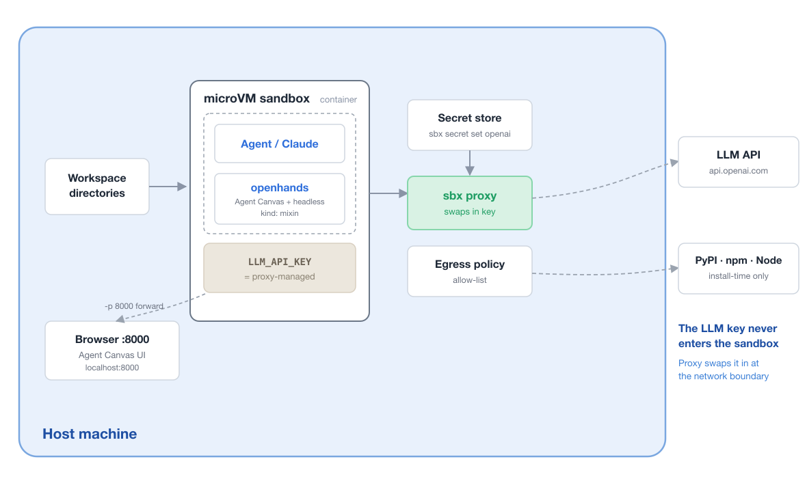

# sbx kits for OpenHands

A standalone [Docker Sandboxes](https://docs.docker.com/ai/sandboxes/) kit
(`kind: mixin`) that installs [OpenHands](https://github.com/OpenHands/OpenHands)
**Agent Canvas** ~ the browser UI + backend server (`agent-canvas`, port 8000)
that replaced the now-deprecated interactive CLI plus the still-supported
**headless** `openhands` runner, and wires both to an LLM through
[LiteLLM](https://github.com/BerriAI/litellm). A one-shot smoke-test runbook and
a Canvas launcher ship alongside.

> **Why the change?** OpenHands moved its interactive CLI/TUI to maintenance mode
> in favour of [Agent Canvas](https://docs.openhands.dev/openhands/usage/agent-canvas/overview).
> The **headless** and ACP modes remain fully supported for automation, this kit
> keeps them for verification and scripting.

**Anthropic Claude** is the zero-config default. The provider is swappable to
OpenAI or to a local [Docker Model Runner](https://docs.docker.com/ai/model-runner/).
See [providers/](./providers/) for copy-paste config.

## Architecture



The kit runs inside an sbx microVM sandbox. Your `LLM_API_KEY` stays
**proxy-managed** and never enters the sandbox, the **sbx proxy** swaps in the
real key at the network boundary, and an egress **allow-list** limits build-time
traffic (PyPI · npm · Node). The **Agent Canvas** UI is reached from the host
browser via the `-p 8000` port-forward.

## Quickstart (Anthropic)

```bash
# 1. Sign in to Docker Hub
sbx login

# 2. Store your Anthropic key on the host (once) — it never enters the sandbox
echo "$ANTHROPIC_API_KEY" | sbx secret set anthropic

# 3. Launch the kit — forward port 8000 for Agent Canvas, run from a repo clone
git clone https://github.com/ajeetraina/sbx-kits-openhands.git
cd sbx-kits-openhands
sbx run -p 8000 --kit ./kits/anthropic shell

# 4a. Inside the sandbox: start Agent Canvas, then open http://localhost:8000
bash ~/runbooks/canvas.sh

# 4b. Or prove it end-to-end without a browser (headless one-shot)
bash ~/runbooks/smoke.sh
```

`env | grep LLM_API_KEY` inside the sandbox shows a placeholder, never your real
`sk-ant-…` key. Full walkthrough and the `openai` / `dmr` providers are below.

## What the kit does

Layered onto an agent, the mixin does these observable things:

1. Installs **Node.js 22** and OpenHands **Agent Canvas** (`npm i -g
   @openhands/agent-canvas`, bin: `agent-canvas`) — the browser UI + backend
   server on port 8000.
2. Installs `uv` and the headless OpenHands runner (`uv tool install openhands
   --python 3.12`) onto `~/.local/bin`, which it adds to `PATH`.
3. Sets `LLM_MODEL` / `LLM_API_KEY` (/ `LLM_BASE_URL` for the local model
   runner) so both surfaces know which model to drive.
4. For cloud providers, routes LLM traffic through the sbx proxy so the key is
   attached on the wire (`x-api-key` for Anthropic, `Authorization: Bearer` for
   OpenAI) and never enters the sandbox.
5. Ships `~/runbooks/canvas.sh` (launches Agent Canvas) and `~/runbooks/smoke.sh`
   (headless end-to-end check), and injects a memory note so the sandbox's own
   agent knows OpenHands is available.

**No key lives in the sandbox.** `sbx run` has no `-e` flag: you store the key
once with sbx's secret manager and the proxy injects it into outbound LLM
requests, so it never enters the microVM, shell history, or `ps`.

> **Agent Canvas needs port 8000 forwarded.** Launch the sandbox with
> `sbx run -p 8000 …` so the browser UI is reachable at http://localhost:8000.
> Agent Canvas doesn't read the `LLM_*` env vars, so start it via
> `~/runbooks/canvas.sh` — that launcher seeds the model into Canvas' settings
> API after startup, so the UI opens preconfigured and you shouldn't need to
> touch **Settings > LLM**.

> **The headless runner ignores `LLM_*` unless you pass `--override-with-envs`.**
> The `smoke.sh` runbook does this for you. This is an OpenHands design choice,
> not a kit limitation.

## Prerequisites

### 0. Log in to Docker Hub

```console
sbx login
```

### 1. Get an LLM key (cloud providers)

- **Anthropic** (default): an `sk-ant-…` key from the
  [Claude Console](https://platform.claude.com/).
- **OpenAI**: an `sk-…` key from the
  [OpenAI platform](https://platform.openai.com/api-keys).
- **Docker Model Runner** (`dmr`): no key — pull a model on the host with
  `docker model pull ai/qwen2.5-coder`.

### 2. Store the key with sbx (never on the command line)

The key is never baked into the kit; you store it once on the host. Both
`anthropic` and `openai` are built-in sbx services, so a plain
`sbx secret set <service>` is all you need — the proxy injects the stored key on
outbound requests (as `x-api-key` for Anthropic, `Authorization: Bearer` for
OpenAI), so it never enters the sandbox. Secrets are global by default:

```console
# Anthropic
echo "$ANTHROPIC_API_KEY" | sbx secret set anthropic
# OpenAI
echo "$OPENAI_API_KEY" | sbx secret set openai

sbx secret ls   # confirm the secret is stored
```

(Omit the pipe to be prompted for the value instead of passing it via a
variable. `LLM_API_KEY` in the sandbox stays a placeholder — the real key lives
only on the host.)

**Self-managed sbx? Allow egress once.** If you are *not* under centralized AI
governance, permit the kit's hosts so sandbox requests are not denied by the
network policy (with org-managed governance an admin allows these for you):

```console
sbx policy init balanced   # one-time, only if you have never initialized a policy
sbx policy allow network "api.anthropic.com,pypi.org,files.pythonhosted.org,github.com,objects.githubusercontent.com,release-assets.githubusercontent.com,astral.sh,nodejs.org,registry.npmjs.org,ghcr.io,pkg-containers.githubusercontent.com"
```

`sbx policy log <sandbox>` shows any host that was blocked, so you can allow
exactly that one.

### 3. Launch the sandbox with the kit

Each provider is published as its own image tag — pick the one matching your
setup. Forward port 8000 so Agent Canvas is reachable.

```console
# Anthropic / Claude (default, recommended) — :latest == :anthropic
sbx run -p 8000 --kit docker.io/ajeetraina777/sbx-openhands-kits:latest shell

# OpenAI
sbx run -p 8000 --kit docker.io/ajeetraina777/sbx-openhands-kits:openai shell

# Local Docker Model Runner (no cloud key)
sbx run -p 8000 --kit docker.io/ajeetraina777/sbx-openhands-kits:dmr shell
```

Or straight from this repo over git (uses the default anthropic provider):

```console
sbx run -p 8000 --kit "git+https://github.com/ajeetraina/sbx-kits-openhands.git" shell
```

Or from a local clone (the default kit lives at the repo root):

```console
git clone https://github.com/ajeetraina/sbx-kits-openhands.git
sbx run -p 8000 --kit ./sbx-kits-openhands/ shell
```

#### Why the `shell` agent

The trailing argument (`shell` above) is the **base agent** that supplies the
sandbox container. OpenHands is provider-agnostic and runs as its own process
inside that container — it uses your LLM purely over the provider API, so it
does not need a coding agent (like Claude Code) in the loop. The kit therefore
pins the neutral **`shell`** base (`docker/sandbox-templates:shell-docker`) via
`requires.agent: shell`:

- No Claude Code image is pulled — the container is a plain shell.
- `shell` already declares the built-in provider credentials (`anthropic`,
  `openai`, …), so it injects your stored key (`sbx secret set …`) onto the
  right header for the provider host. The kit declares **no** credential of its
  own, which is what avoids the "credential … defined in both … and openhands"
  compose error.

Because the kit pins `shell`, composing it onto a different agent fails fast at
create time rather than silently mis-authenticating.

### 4. Confirm the kit installed correctly

Inside the agent session, use `!` shell escapes to prove the mixin is really
inside.

**4a. Both OpenHands surfaces are installed:**

```console
!command -v agent-canvas && node --version
!command -v openhands
```

**4b. The mixin's env is present** (a fingerprint that the kit wired things up):

```console
!env | grep -E 'LLM_MODEL|LLM_API_KEY'
```

`LLM_API_KEY` holds a placeholder for cloud providers; the real key lives only on
the host and is injected on the wire.

**4c. End-to-end functional proof** — run a headless one-shot task through
OpenHands. This exercises the installed binary, the env vars, the proxy-injected
key, and a live round-trip to the model, so if you only run one check, run this:

```console
!bash ~/runbooks/smoke.sh
```

### 5. Use OpenHands

**Agent Canvas (primary, interactive)** — start the server, then open the UI in
your browser (port 8000 must be forwarded, see step 3):

```console
bash ~/runbooks/canvas.sh          # serves http://localhost:8000
```

Confirm the default local backend shows as **connected**, then start a
conversation. `canvas.sh` seeds the model (`LLM_MODEL`) into Canvas' settings
after startup — Agent Canvas itself doesn't read the `LLM_*` env vars — so you
shouldn't need to configure **Settings > LLM** by hand.

**Headless (automation / CI)** — the still-supported `openhands` runner
(remember `--override-with-envs`):

```console
openhands --headless --override-with-envs --exit-without-confirmation -t "Add tests for utils.py"
openhands --headless --override-with-envs --exit-without-confirmation -f task.md
```

### 6. Try the runbooks

The kit ships runnable demos under `~/runbooks/`. They are plain files under
[`files/home/runbooks/`](./files/home/runbooks/) (the
[sbx-kits-contrib][contrib] `files/home/` convention — everything under it is
mirrored into `/home/agent/`), **not** hard-coded into `spec.yaml`:

```console
!bash ~/runbooks/canvas.sh         # launch Agent Canvas (port 8000)
!bash ~/runbooks/smoke.sh          # headless end-to-end check
!bash ~/runbooks/smoke.sh "write a Python function that reverses a string, with a test"
```

To add a runbook, drop a file in `files/home/runbooks/` — it ships
automatically, no `spec.yaml` change.

[contrib]: https://github.com/docker/sbx-kits-contrib

## Switching the LLM provider

| Provider | `LLM_MODEL` | LLM | Credential | Doc |
|---|---|---|---|---|
| anthropic (default) | `anthropic/claude-opus-4-8` | Anthropic `api.anthropic.com` | API key | [providers/anthropic.md](./providers/anthropic.md) |
| openai | `openai/gpt-4o` | OpenAI `api.openai.com` | API key | [providers/openai.md](./providers/openai.md) |
| dmr | `openai/ai/qwen2.5-coder` | local Docker Model Runner | none | [providers/dmr.md](./providers/dmr.md) |

Each page has the exact `LLM_MODEL`, run command, and setup notes. Overview:
[providers/README.md](./providers/README.md).

## Troubleshooting

**`mount policy denied: /Users/<you>`** when running `sbx run --kit docker.io/..`:
the sbx runtime refuses to mount your home directory into the sandbox. Run
`sbx run` from any directory other than your home directory.

**Can't reach Agent Canvas at http://localhost:8000:** confirm the sandbox was
launched with `sbx run -p 8000 …` (the port must be forwarded) and that
`agent-canvas` is actually running (`~/runbooks/canvas.sh`). Use a different port
with `PORT=3000 bash ~/runbooks/canvas.sh` and `sbx run -p 3000 …`.

**`agent-canvas: command not found`:** the Node.js install or the global npm
install did not complete. Check `node --version` (must be ≥ 22.12) and re-run
`npm install -g @openhands/agent-canvas`.

**`openhands: command not found`:** the headless runner installs to
`~/.local/bin` via `uv tool install`. The kit adds that to `PATH`; if a custom
shell rc overrode `PATH`, run `export PATH=/home/agent/.local/bin:$PATH` or
re-check the install step (`uv tool list`).

**OpenHands seems to ignore the model / key** (headless): you almost certainly
forgot `--override-with-envs`. The headless runner ignores the `LLM_*` env vars
without it. The smoke-test runbook passes it for you.

**Network policy denied a request** (egress blocked reaching `api.anthropic.com`
or the install hosts): if you self-manage sbx policy and have no centralized
governance, allow the kit's hosts once (global scope):

```console
sbx policy allow network "api.anthropic.com,pypi.org,files.pythonhosted.org,github.com,objects.githubusercontent.com,release-assets.githubusercontent.com,astral.sh,nodejs.org,registry.npmjs.org,ghcr.io,pkg-containers.githubusercontent.com"
```

Under org-managed governance a local allow cannot widen egress — an admin must
add the allow. `sbx policy log <sandbox>` names the exact blocked host.

**`401`/authentication error from the LLM:** confirm the secret is stored for
the right service (`sbx secret ls` — `anthropic` for Anthropic, `openai` for
OpenAI).

**DMR: OpenHands can't reach the model:** confirm Docker Model Runner is running
on the host (`docker model ls`) and that the model named in `LLM_MODEL` is
pulled (`docker model pull ai/qwen2.5-coder`).
